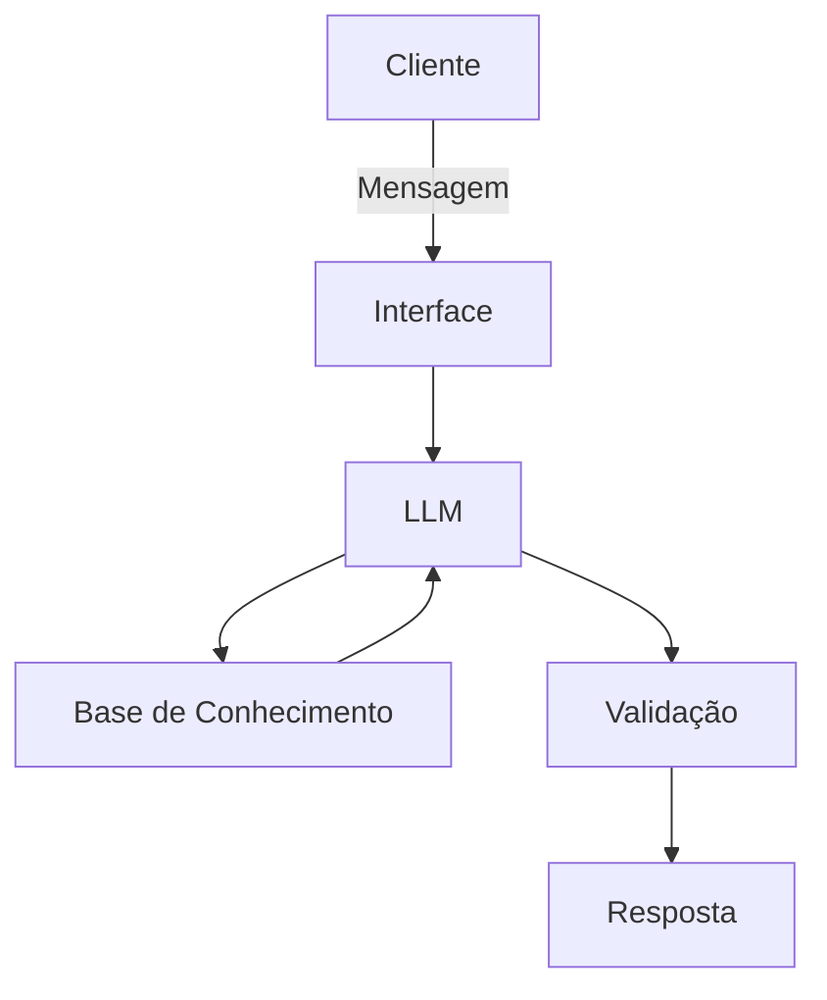

# 🤖 Agente Financeiro Inteligente com IA Generativa

## Contexto

Os assistentes virtuais no setor financeiro estão evoluindo de simples chatbots reativos para **agentes inteligentes e proativos**. Neste desafio, você vai idealizar e prototipar um agente financeiro que utiliza IA Generativa para:

- **Antecipar necessidades** ao invés de apenas responder perguntas
- **Personalizar** sugestões com base no contexto de cada cliente
- **Cocriar soluções** financeiras de forma consultiva
- **Garantir segurança** e confiabilidade nas respostas (anti-alucinação)

---

## 1. Documentação do Agente

## Caso de Uso

### Persona e Comunicação

Como o agente se comporta e se comunica? O agente se porta de modo educado explicando conceitos financeiros de forma simples, usa os dados do usuário para exemplo e não recomenda investimentos

- Nome: Alfred
- Personalidade: Educado, usa exemplos práticos e objetivos, não julga o usuário por seus gastos
- Comunicação: Informal, acessível, didático e paciente, como um professor jovem

## Exemplos de linguagem

- Saudação: "Olá! Sou o Alfred seu ajudante financeiro. Como posso ajudar hoje?"
- Confirmação: "Entendi! Vou te explicar de forma simples."
- Erro/Limitação: "Não posso recomendar investimentos, mas posso explicar como funcionam!"

## Público-Alvo

Iniciantes em finanças pessoais e interessados em aprender sobre economia.

## Arquitetura

### Componentes

| Componente | Descrição |
|------------|-----------|
| Interface | Streamlit|
| LLM                  | Ollama|
| Base de Conhecimento | JSON/CSV mockados |

## Segurança Anti-Alucinação

### Estratégias

- Usa somente os dados fornecidos em contexto.
- Admite quando não sabe e algo.
- Foca em apenas educar o usuário, não aconselha.

### Limitações

- Não recomenda investimentos.
- Não acessa dados bancários sensíveis.
- Não exclui a consulta com um profissional certificado.

---

## 2. Base de Conhecimento

| Arquivo | Formato | Descrição para o agente|
|---------|---------|-----------|
| `historico_atendimento.csv` | CSV | Interações anteriores, para dar continuidade ao atendimento de forma eficiente. |
| `perfil_investidor.json` | JSON | Personalizar explicações sobre dúvudas e necessidades de aprendizado do cliente. |
| `produtos_financeiros.json` | JSON | Conhecer os produtos disponíveis para serem explicados o funcionamento ao cliente. |
| `transacoes.csv` | CSV | Analisar padrões de gastos do cliente e usar estes dados de forma didática. |

📄 **Template:** [`docs/02-base-conhecimento.md`](./docs/02-base-conhecimento.md)

---

### 3. Prompts do Agente

Documente os prompts que definem o comportamento do seu agente:

- **System Prompt:** Instruções gerais de comportamento e restrições
- **Exemplos de Interação:** Cenários de uso com entrada e saída esperada
- **Tratamento de Edge Cases:** Como o agente lida com situações limite

📄 **Template:** [`docs/03-prompts.md`](./docs/03-prompts.md)

---

### 4. Aplicação Funcional

Desenvolva um **protótipo funcional** do seu agente:

- Chatbot interativo (sugestão: Streamlit, Gradio ou similar)
- Integração com LLM (via API ou modelo local)
- Conexão com a base de conhecimento

📁 **Pasta:** [`src/app.py`](./src/app.py)

---

### 5. Avaliação e Métricas

Descreva como você avalia a qualidade do seu agente:

**Métricas Sugeridas:**
- Precisão/assertividade das respostas
- Taxa de respostas seguras (sem alucinações)
- Coerência com o perfil do cliente

📄 **Template:** [`docs/04-metricas.md`](./docs/04-metricas.md)

---

### 6. Pitch

Grave um **pitch de 3 minutos** (estilo elevador) apresentando:

- Qual problema seu agente resolve?
- Como ele funciona na prática?
- Por que essa solução é inovadora?

📄 **Template:** [`docs/05-pitch.md`](./docs/05-pitch.md)

---

## Dicas Finais

1. **Comece pelo prompt:** Um bom system prompt é a base de um agente eficaz
2. **Use os dados mockados:** Eles garantem consistência e evitam problemas com dados sensíveis
3. **Foque na segurança:** No setor financeiro, evitar alucinações é crítico
4. **Teste cenários reais:** Simule perguntas que um cliente faria de verdade
5. **Seja direto no pitch:** 3 minutos passam rápido, vá ao ponto
