# 🤖 Agente Financeiro Inteligente com IA Generativa

## Contexto

Os assistentes virtuais no setor financeiro estão evoluindo de simples chatbots reativos para **agentes inteligentes e proativos**. Neste desafio, você vai idealizar e prototipar um agente financeiro que utiliza IA Generativa para:

- **Antecipar necessidades** ao invés de apenas responder perguntas
- **Personalizar** sugestões com base no contexto de cada cliente
- **Cocriar soluções** financeiras de forma consultiva
- **Garantir segurança** e confiabilidade nas respostas (anti-alucinação)

---

## 1. Documentação do Agente

## Caso de Uso

### Persona e Comunicação

Como o agente se comporta e se comunica? O agente se porta de modo educado explicando conceitos financeiros de forma simples, usa os dados do usuário para exemplo e não recomenda investimentos

- Nome: Alfred
- Personalidade: Educado, usa exemplos práticos e objetivos, não julga o usuário por seus gastos
- Comunicação: Informal, acessível, didático e paciente, como um professor jovem

## Exemplos de linguagem

- Saudação: "Olá! Sou o Alfred seu ajudante financeiro. Como posso ajudar hoje?"
- Confirmação: "Entendi! Vou te explicar de forma simples."
- Erro/Limitação: "Não posso recomendar investimentos, mas posso explicar como funcionam!"

## Público-Alvo

Iniciantes em finanças pessoais e interessados em aprender sobre economia.

## Arquitetura

```mermaid
flowchart TD
    A[Cliente] -->|Mensagem| B[Interface]
    B --> C[LLM]
    C --> D[Base de Conhecimento]
    D --> C
    C --> E[Validação]
    E --> F[Resposta]
```



### Componentes

| Componente | Descrição |
|------------|-----------|
| Interface | Streamlit|
| LLM                  | Ollama|
| Base de Conhecimento | JSON/CSV mockados |

## Segurança Anti-Alucinação

### Estratégias

- Usa somente os dados fornecidos em contexto.
- Admite quando não sabe e algo.
- Foca em apenas educar o usuário, não aconselha.

### Limitações

- Não recomenda investimentos.
- Não acessa dados bancários sensíveis.
- Não exclui a consulta com um profissional certificado.

---

## 2. Base de Conhecimento

| Arquivo | Formato | Descrição para o agente|
|---------|---------|-----------|
| `historico_atendimento.csv` | CSV | Interações anteriores, para dar continuidade ao atendimento de forma eficiente. |
| `perfil_investidor.json` | JSON | Personalizar explicações sobre dúvudas e necessidades de aprendizado do cliente. |
| `produtos_financeiros.json` | JSON | Conhecer os produtos disponíveis para serem explicados o funcionamento ao cliente. |
| `transacoes.csv` | CSV | Analisar padrões de gastos do cliente e usar estes dados de forma didática. |

---

### 3. Prompts do Agente

Documente os prompts que definem o comportamento do seu agente:

- **System Prompt:** Instruções gerais de comportamento e restrições
- **Exemplos de Interação:** Cenários de uso com entrada e saída esperada
- **Tratamento de Edge Cases:** Como o agente lida com situações limite

📄 **Template:** [`docs/03-prompts.md`](./docs/03-prompts.md)

---

### 4. Aplicação Funcional

Desenvolva um **protótipo funcional** do seu agente:

- Chatbot interativo (sugestão: Streamlit, Gradio ou similar)
- Integração com LLM (via API ou modelo local)
- Conexão com a base de conhecimento

📁 **Pasta:** [`src/`](./src/)

---

### 5. Avaliação e Métricas

Descreva como você avalia a qualidade do seu agente:

**Métricas Sugeridas:**
- Precisão/assertividade das respostas
- Taxa de respostas seguras (sem alucinações)
- Coerência com o perfil do cliente

📄 **Template:** [`docs/04-metricas.md`](./docs/04-metricas.md)

---

### 6. Pitch

Grave um **pitch de 3 minutos** (estilo elevador) apresentando:

- Qual problema seu agente resolve?
- Como ele funciona na prática?
- Por que essa solução é inovadora?

📄 **Template:** [`docs/05-pitch.md`](./docs/05-pitch.md)

---

## Ferramentas Sugeridas

Todas as ferramentas abaixo possuem versões gratuitas:

| Categoria | Ferramentas |
|-----------|-------------|
| **LLMs** | [ChatGPT](https://chat.openai.com/), [Copilot](https://copilot.microsoft.com/), [Gemini](https://gemini.google.com/), [Claude](https://claude.ai/), [Ollama](https://ollama.ai/) |
| **Desenvolvimento** | [Streamlit](https://streamlit.io/), [Gradio](https://www.gradio.app/), [Google Colab](https://colab.research.google.com/) |
| **Orquestração** | [LangChain](https://www.langchain.com/), [LangFlow](https://www.langflow.org/), [CrewAI](https://www.crewai.com/) |
| **Diagramas** | [Mermaid](https://mermaid.js.org/), [Draw.io](https://app.diagrams.net/), [Excalidraw](https://excalidraw.com/) |

---

## Estrutura do Repositório

```
📁 lab-agente-financeiro/
│
├── 📄 README.md
│
├── 📁 data/                          # Dados mockados para o agente
│   ├── historico_atendimento.csv     # Histórico de atendimentos (CSV)
│   ├── perfil_investidor.json        # Perfil do cliente (JSON)
│   ├── produtos_financeiros.json     # Produtos disponíveis (JSON)
│   └── transacoes.csv                # Histórico de transações (CSV)
│
├── 📁 docs/                          # Documentação do projeto
│   ├── 01-documentacao-agente.md     # Caso de uso e arquitetura
│   ├── 02-base-conhecimento.md       # Estratégia de dados
│   ├── 03-prompts.md                 # Engenharia de prompts
│   ├── 04-metricas.md                # Avaliação e métricas
│   └── 05-pitch.md                   # Roteiro do pitch
│
├── 📁 src/                           # Código da aplicação
│   └── app.py                        # (exemplo de estrutura)
│
├── 📁 assets/                        # Imagens e diagramas
│   └── ...
│
└── 📁 examples/                      # Referências e exemplos
    └── README.md
```

---

## Dicas Finais

1. **Comece pelo prompt:** Um bom system prompt é a base de um agente eficaz
2. **Use os dados mockados:** Eles garantem consistência e evitam problemas com dados sensíveis
3. **Foque na segurança:** No setor financeiro, evitar alucinações é crítico
4. **Teste cenários reais:** Simule perguntas que um cliente faria de verdade
5. **Seja direto no pitch:** 3 minutos passam rápido, vá ao ponto
